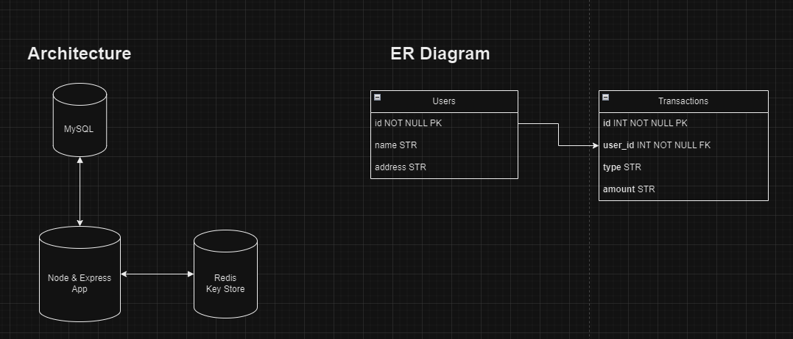
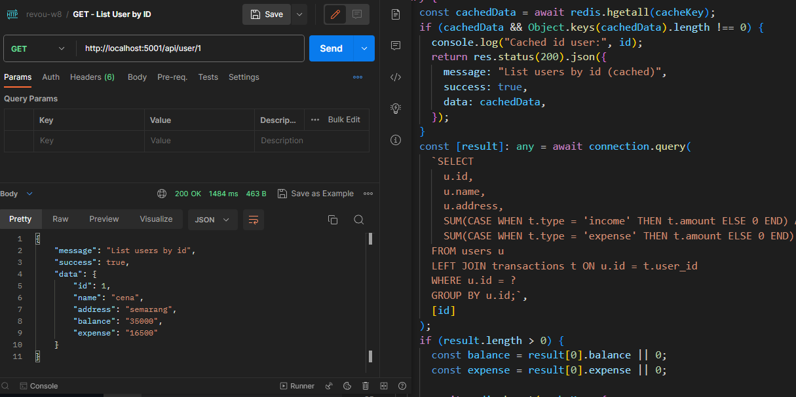
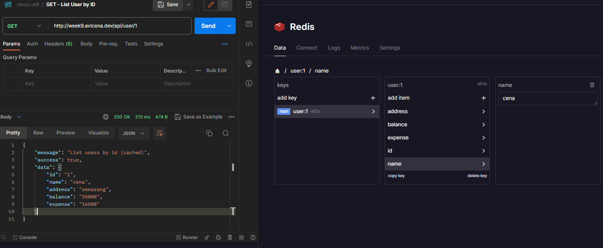
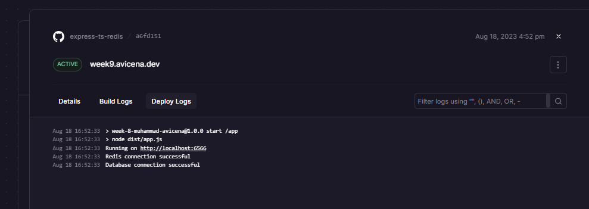

[](https://avicena.dev/)

<h1 align="center">Fancy to see you here  </h1>

hi, I'm Muhammad Avicena. In this repo, I build simple API services TypeScript-based using Node-Express-MySQL with Cache from Redis.

I am committed to staying up-to-date with industry trends and using the latest tools to develop innovative solutions that surpass expectations.
Interested to have collaboration ? Find me on:

[](https://www.linkedin.com/in/muhammad-avicena/)
[](https://www.youtube.com/@MuhammadAvicena)
[](https://www.instagram.com/ryuhideaki.dev/)
[](mailto:cenarahmant.dev@gmail.com)

## INGREDIENTS I USE 📜

- TypeScript
- Node.js & Express.js
- MySQL
- Redis

### Architecture & ERD :



## KEY FEATURES 🌟

- List all of users
- list user by ID
- List all of transactions
- Create a transaction
- Update a transaction
- Delete a transaction

## Redis Usage :

- When a request comes in to fetch an API, first check if the requested data is available in the cache.
- If the data is found in the cache, return it directly from the cache and avoid hitting the main data source (like a database).

- If the data is not in the cache, fetch it from the main data source (database) and then store it in the cache for future use. Make sure to set an appropriate expiration time on the cached data to ensure it's refreshed periodically.

**Set cache in `List user by ID` :**

- Implement cache to improve performance and reduce cost of heavy querry operations

**Set TTL(Time-to-Live) in `Update a transaction, Create transactions, & Delete transactions` from ID user :**

- Implement TTL to maintain real data & efficient resource usage

## MySQL & Redis Implementation :

- Heavy querry operations

```sql
GET /api/user/:id : show user by id

    SELECT
        u.id,
        u.name,
        u.address,
        SUM(CASE WHEN t.type = 'income' THEN t.amount ELSE 0 END) AS balance,
        SUM(CASE WHEN t.type = 'expense' THEN t.amount ELSE 0 END) AS expense
    FROM users u
    LEFT JOIN transactions t ON u.id = t.user_id
    WHERE u.id = ?
    GROUP BY u.id;`
```



- Set Redis & TTL

```javascript
// Declare cache key for user
const cacheKey = "user:" + id;

// Check the cache key is exists
const cachedData = await redis.hgetall(cacheKey);
if (cachedData && Object.keys(cachedData).length !== 0) {
  console.log("Cached id user:", id);
  return res.status(200).json({
    message: "List users by id (cached)",
    success: true,
    data: cachedData,
  });
}

// Set the cache key if it doesn't exist
await redis.hmset(cacheKey, {
  id: result[0].id,
  name: result[0].name,
  address: result[0].address,
  balance: balance,
  expense: expense,
});

// Set expire for the cache key in 10 minutes 
await redis.expire(cacheKey, 600);
```



## AVAILABLE API 📰

**Back-end endpoint:** [https://week9.avicena.dev](https://week9.avicena.dev)

| Name                         | HTTP Method | Endpoint                                                                       | Requirements                                                                                        |
| ---------------------------- | ----------- | ------------------------------------------------------------------------------ | --------------------------------------------------------------------------------------------------- |
| **List All User**            | `GET`       | [/api/user](https://week9.avicena.dev/api/user)                                |
| **List All Transaction**     | `GET`       | [/api/transaction](https://week9.avicena.dev/api/transaction)                  |
| **List User by ID**          | `GET`       | [/api/user/:id](https://week9.avicena.dev/api/user/1)                          | Request Params: `id: number`                                                                        |
| **Create Transaction**       | `POST`      | [/api/transaction](https://week9.avicena.dev/api/transaction)                  | Request Body: `user_id: number, type: string, amount: number`                                       |
| **Update Transaction by ID** | `PUT`       | [/api/transaction/:transactionId](https://week9.avicena.dev/api/transaction/1) | Request Params: `id: number` <br> <br>Request Body: `user_id: number, type: string, amount: number` |
| **Delete Transaction by ID** | `DELETE`    | [/api/transaction/:id](https://week9.avicena.dev/api/transaction/1)            | Request Params: `id: number`                                                                        |

## DEPLOYMENT ⚙️



The project has been successfully deployed using Railway App. You can access the production version of the website by following this link: [https://week9.avicena.dev](https://week9.avicena.dev).

Feel free to explore the website and try out the different features. I appreciate any feedback and suggestions to further improve the user experience.
